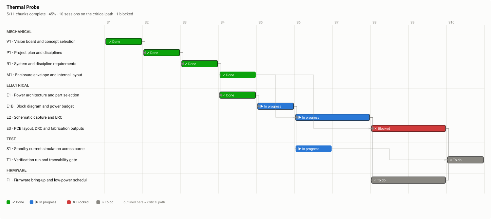

# Plan — Thermal Probe

What work exists, what each piece is, and what has to happen first.
**Statuses are deliberately not in this file** — see the chart in the README for those. This is the scope, and it is what the plan review signs off.

11 chunks · 10 sessions on the critical path · disciplines: mechanical, electrical, firmware, test

## The work

### mechanical

#### V1 — Vision board and concept selection  *(critical path)*

Interview, then two concepts as build123d modules — a one-handed wand and a bench instrument — rendered into a vision document with envelopes and masses measured off the models.

* **Needs first:** nothing
* **Estimate:** 1 session
* **Produces:** `docs/design/vision.md`, `docs/design/vision/`
* **Human review:** `vision` must be signed off before this chunk can be done

#### P1 — Project plan and disciplines  *(critical path)*

Agree what work exists and in what order, and which disciplines the project actually has.

* **Needs first:** V1
* **Estimate:** 1 session
* **Produces:** `docs/plan.md`
* **Human review:** `plan` must be signed off before this chunk can be done

#### R1 — System and discipline requirements  *(critical path)*

VIS- intent decomposed into testable SYS- requirements, then into ELE-, MEC- and FW- requirements with budgets that roll up.

* **Needs first:** P1
* **Estimate:** 1 session
* **Produces:** `requirements/`, `docs/design/requirements-map.svg`
* **Human review:** `requirements` must be signed off before this chunk can be done

#### M1 — Enclosure envelope and internal layout

Outer envelope frozen from the agreed concept, cell and board volumes placed, and the board outline published as an interface.

* **Needs first:** R1
* **Estimate:** 1 session
* **Produces:** `cad/enclosure.py`

### electrical

#### E1 — Power architecture and part selection  *(critical path)*

Cell chemistry, charger, regulator topology and the always-on rail budget. The 40 uA standby figure is decided here.

* **Needs first:** R1
* **Estimate:** 1 session
* **Produces:** `docs/design/adr-0002-power.md`

#### E1B — Block diagram and power budget  *(critical path)*

Every IC, the full power tree with a current budget per rail, and the data buses with their controllers. Settled before any schematic exists.

* **Needs first:** E1
* **Estimate:** 1 session
* **Produces:** `hw/block-diagram.yaml`, `docs/design/block-diagram.svg`
* **Human review:** `architecture` must be signed off before this chunk can be done

#### E2 — Schematic capture and ERC  *(critical path)*

Capture the agreed block diagram, pick every passive against house practice, and get ERC clean.

* **Needs first:** E1B, M1
* **Estimate:** 2 sessions
* **Produces:** `hw/probe.kicad_sch`, `docs/design/schematic.pdf`
* **Human review:** `schematic` must be signed off before this chunk can be done

#### E3 — PCB layout, DRC and fabrication outputs  *(critical path)*

Two-layer board inside the frozen outline. Pre-route checks first — net class widths against pad sizes, DRC on the placed board.

* **Needs first:** E2, M1
* **Estimate:** 2 sessions
* **Produces:** `hw/probe.kicad_pcb`, `docs/design/pcb-layers.pdf`
* **Human review:** `layout` must be signed off before this chunk can be done

### test

#### S1 — Standby current simulation across corners

ngspice on the always-on rail at tolerance, temperature and supply extremes, cross-checked against the closed-form leakage sum.

* **Needs first:** E1B
* **Estimate:** 1 session
* **Produces:** `sim/standby/`, `docs/design/standby-results.md`

#### T1 — Verification run and traceability gate  *(critical path)*

Close every requirement against evidence at the corners, or report it unmet. Walk back up to the VIS- entries.

* **Needs first:** E3, F1, S1
* **Estimate:** 1 session
* **Produces:** `docs/design/verification-report.md`
* **Human review:** `verification` must be signed off before this chunk can be done

### firmware

#### F1 — Firmware bring-up and low-power scheduler  *(critical path)*

Boot, ADC sampling, flash logging and the sleep scheduler that the 40 uA budget depends on.

* **Needs first:** E2
* **Estimate:** 2 sessions
* **Produces:** `fw/`

## What we are asking you

1. **Is this all the work?** Test, documentation and manufacturing are the ones that get left out.
2. **Is the order right?** You may know a constraint we do not — a part already on the shelf, a lead time, a review that has to pass.
3. **Is any chunk the wrong size?** One chunk is about one working session; a chunk that is really three should be split now.

---

Generated by `plan-render` from `plan.yaml`. Edit the plan, not this file.
