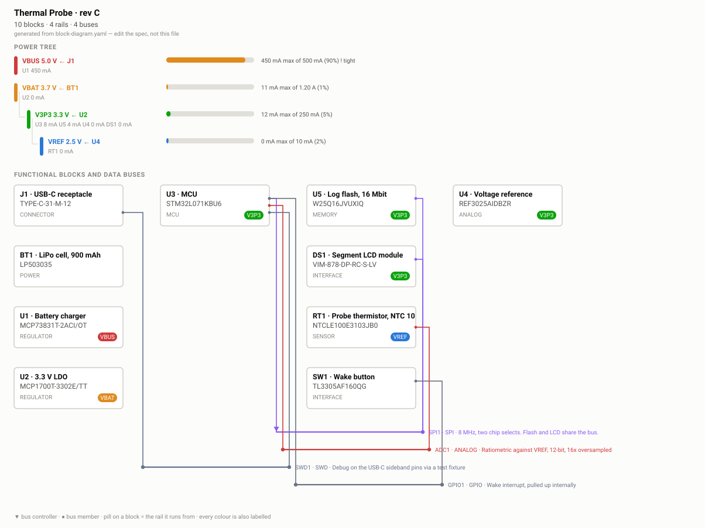

# Review — Block diagram, power tree and buses

`architecture` · requested 2026-08-31 · branch `claude/makehardware-human-review-xo14y4`

Four rails. VBUS is the tight one at 90% of the USB-C default
500 mA while charging, which is fine because it is a charge-only rail — but it
is the number to check. Standby on V3P3 comes to 12 uA of the 40 uA budget.

## What you are agreeing to

**block-diagram.svg**



## For context

Sources and working files. Not part of the agreement — these change as work goes on, and changing them does not invalidate your sign-off.

| File | Opens in |
|---|---|
| [hw/block-diagram.drawio](https://github.com/Harwasch/MakeHardware/blob/claude/makehardware-human-review-xo14y4/hw/block-diagram.drawio) | draw.io / VS Code extension |
| [hw/block-diagram.yaml](https://github.com/Harwasch/MakeHardware/blob/claude/makehardware-human-review-xo14y4/hw/block-diagram.yaml) | plain text on GitHub |

## What we need decided

1. Is a rail or a part missing?
2. SPI1 shares flash and LCD on one bus — acceptable, or separate them?
3. Is charging at 450 mA off a 500 mA port too close?

## Decision

**Not yet reviewed — this is waiting on you.**

Answer in the Claude session that sent you this link. There is nothing to run and nothing to sign here.

Say which option you want **and why**: the reason is worth more than the choice, and it is what gets re-read later when a number has to move. If something is wrong, say what would be right.

<details><summary>How the answer gets recorded</summary>

The agent writes your decision, in your words, into [`docs/review/reviews.yaml`](https://github.com/Harwasch/MakeHardware/blob/claude/makehardware-human-review-xo14y4/docs/review/reviews.yaml):

```bash
review-gate sign architecture --approve --by <name> --note "..."
review-gate sign architecture --changes "what to change"
```

Until that happens, any chunk of work depending on this review cannot be marked done.

</details>

---

<sub>Generated by `review-gate`. The sign-off record is [`docs/review/reviews.yaml`](https://github.com/Harwasch/MakeHardware/blob/claude/makehardware-human-review-xo14y4/docs/review/reviews.yaml).</sub>
