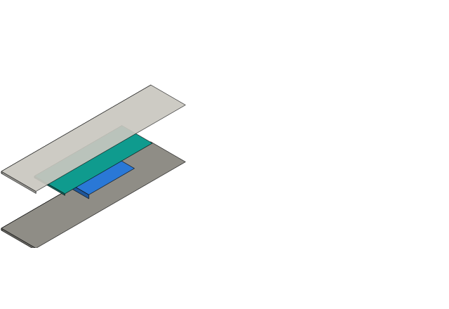

# Review — Enclosure, rev C

`cad` · requested 2026-09-04 · branch `claude/ai-schematic-pcb-practices-mdap63`

Envelope frozen from the agreed wand concept. The board outline is
published as an interface at 33.4 x 96 mm and the electrical side is now working
to it, so moving it is expensive from here.

## What you are agreeing to

**enclosure-render.png**

## For context

Sources and working files. Not part of the agreement — these change as work goes on, and changing them does not invalidate your sign-off.

| File | Opens in |
|---|---|
| [cad/enclosure.py](https://github.com/Harwasch/MakeHardware/blob/claude/ai-schematic-pcb-practices-mdap63/cad/enclosure.py) | plain text on GitHub |

## What we need decided

1. Board-to-lid clearance is 8.4 mm. Enough for the display and its zebra strip?
2. Split line at 40% depth puts the seam on the grip. Acceptable?

## Decision

**Approved** 2026-09-04 by harrison. Nothing is needed from you here.

> Yes to both. Move the seam to 45% if the tooling allows it, but do not
> hold the schematic for it.

---

Generated by `review-gate`. The sign-off record is [`docs/review/reviews.yaml`](https://github.com/Harwasch/MakeHardware/blob/claude/ai-schematic-pcb-practices-mdap63/docs/review/reviews.yaml).
