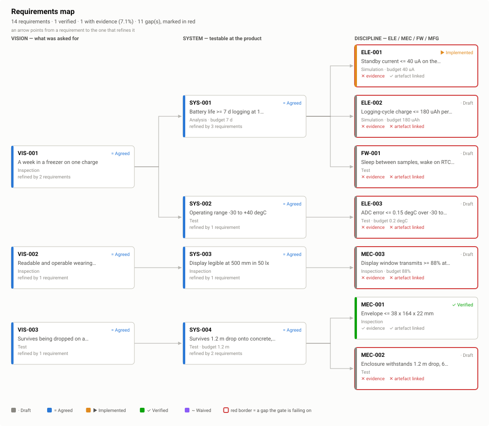

# Review — Requirements tree

`requirements` · requested 2026-08-31 · branch `claude/makehardware-human-review-xo14y4`

Fifteen requirements. SYS-001 moved from 12 h to 7 d after the
logging interval was settled at one minute, which is the number worth arguing
about.

## What you are agreeing to

**requirements-map.svg**

## For context

Sources and working files. Not part of the agreement — these change as work goes on, and changing them does not invalidate your sign-off.

| File | Opens in |
|---|---|
| [requirements/00-vision.sdoc](https://github.com/Harwasch/MakeHardware/blob/claude/makehardware-human-review-xo14y4/requirements/00-vision.sdoc) | StrictDoc source |
| [requirements/10-system.sdoc](https://github.com/Harwasch/MakeHardware/blob/claude/makehardware-human-review-xo14y4/requirements/10-system.sdoc) | StrictDoc source |
| [requirements/hardware.sgra](https://github.com/Harwasch/MakeHardware/blob/claude/makehardware-human-review-xo14y4/requirements/hardware.sgra) | download |

## What we need decided

1. Is 7 days the right target, or is 5 with a smaller cell better?
2. Is anything here that nobody asked for?

## Decision

**Approved** 2026-08-31 by harrison. Nothing is needed from you here.

> 7 days. A week means Friday-to-Friday and nobody has to think.

---

Generated by `review-gate`. The sign-off record is [`docs/review/reviews.yaml`](https://github.com/Harwasch/MakeHardware/blob/claude/makehardware-human-review-xo14y4/docs/review/reviews.yaml).
