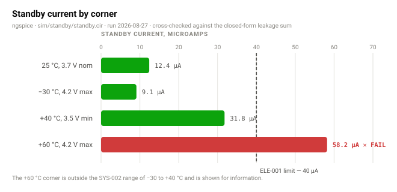
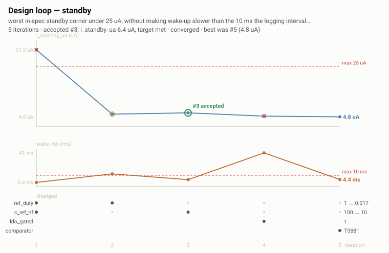

# Review — Standby current, after five passes

`standby` · requested 2026-09-20 · branch `claude/board-docs`

Duty-cycling the reference gets the +40 C corner to 6.4 uA. #5
was lower and #3 was faster to wake; I took #3.

## What you are agreeing to

**standby-corners.svg**



**standby-evolution.svg**



## For context

Sources and working files. Not part of the agreement — these change as work goes on, and changing them does not invalidate your sign-off.

| File | Opens in |
|---|---|
| [docs/design/iterations/standby.json](https://github.com/Harwasch/MakeHardware/blob/claude/board-docs/docs/design/iterations/standby.json) | plain text on GitHub |
| [docs/design/standby-results.md](https://github.com/Harwasch/MakeHardware/blob/claude/board-docs/docs/design/standby-results.md) | renders on GitHub |

## What we need decided

1. Take #3 at 6.4 uA, or #5 at 4.8 uA for a second comparator part?
2. Is 4.2 ms wake-up inside what the one-minute log interval needs?

## Decision

**Not yet reviewed — this is waiting on you.**

Answer in the Claude session that sent you this link. There is nothing to run and nothing to sign here.

Say which option you want **and why**: the reason is worth more than the choice, and it is what gets re-read later when a number has to move. If something is wrong, say what would be right.

<details><summary>How the answer gets recorded</summary>

The agent writes your decision, in your words, into [`docs/review/reviews.yaml`](https://github.com/Harwasch/MakeHardware/blob/claude/board-docs/docs/review/reviews.yaml):

```bash
review-gate sign standby --approve --by <name> --note "..."
review-gate sign standby --changes "what to change"
```

Until that happens, any chunk of work depending on this review cannot be marked done.

</details>

---

<sub>Generated by `review-gate`. The sign-off record is [`docs/review/reviews.yaml`](https://github.com/Harwasch/MakeHardware/blob/claude/board-docs/docs/review/reviews.yaml).</sub>
