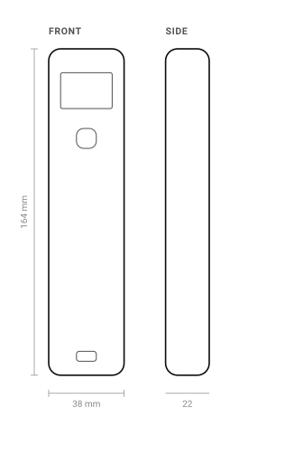
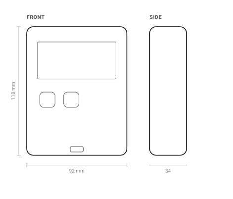

# Review — Vision and concept selection

`vision` · requested 2026-09-04 · branch `claude/ai-schematic-pcb-practices-mdap63`

Two concepts that differ in a nameable way: a one-handed wand
with the probe on a lead, and a bench instrument that lives on a shelf. Both
envelopes are measured off real geometry.

## What you are agreeing to

**elevation.svg**

**elevation.svg**

| File | Opens in |
|---|---|
| [docs/design/vision.md](https://github.com/Harwasch/MakeHardware/blob/claude/ai-schematic-pcb-practices-mdap63/docs/design/vision.md) | renders on GitHub |

## For context

Sources and working files. Not part of the agreement — these change as work goes on, and changing them does not invalidate your sign-off.

| File | Opens in |
|---|---|
| [concepts](https://github.com/Harwasch/MakeHardware/blob/claude/ai-schematic-pcb-practices-mdap63/concepts) | download |

## What we need decided

1. Which concept, and what made you pick it?
2. Is 164 mm too long to hold comfortably in a glove?

## Decision

**Approved** 2026-09-04 by harrison. Nothing is needed from you here.

> The wand. A freezer walk is one-handed and you are already carrying
> a clipboard — the bench version solves a problem we do not have.

---

Generated by `review-gate`. The sign-off record is [`docs/review/reviews.yaml`](https://github.com/Harwasch/MakeHardware/blob/claude/ai-schematic-pcb-practices-mdap63/docs/review/reviews.yaml).
